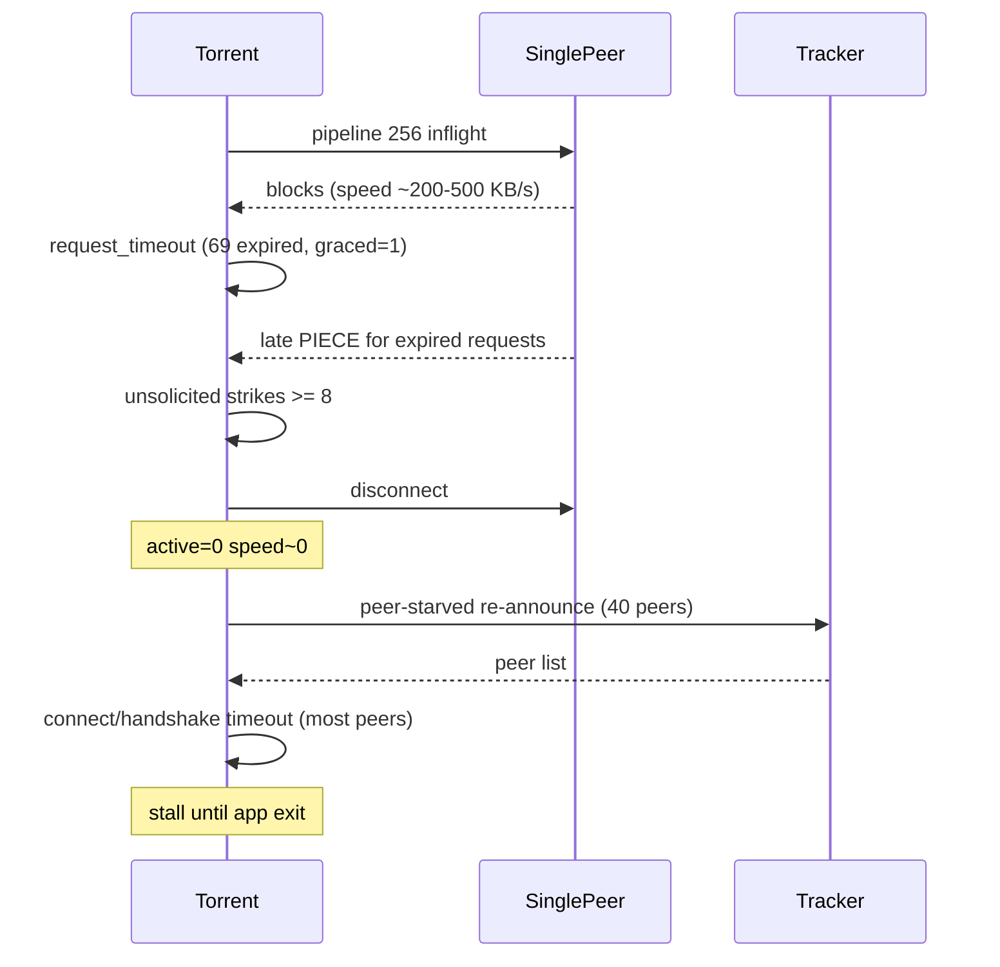

# Почему торрент перестаёт качать (pipensx_5.log)

## Краткий ответ

Торрент **Serial Experiments Lain PSX Offline** (`faf4f729…`, 171 piece × 2 MiB, 8352 файла) качается почти всегда с **одним активным пиром**. Когда у этого пира истекает глубокая очередь из 256 запросов, поздние `PIECE`-ответы считаются «unsolicited», и клиент **сам разрывает соединение** (`[peer] too many unsolicited PIECE frames`). После этого `active=0`, скорость падает к нулю, а **новые пиры с трекера не подключаются** (таймауты TCP/uTP, UPnP не найден, DHT не даёт узлов).

Это произошло **дважды** в одном логе: после 18/171 piece (сессия 1) и после 6/171 piece (сессия 2 после перезапуска).

---

## Хронология смерти (вторая сессия, нагляднее из‑за telemetry)




| Время (ms)       | Событие                                                                                |
| ---------------- | -------------------------------------------------------------------------------------- |
| ~1790360         | Единственный пир: handshake ok, unchoked                                               |
| ~1835528–1861398 | Скачано pieces 1–6/171, постоянно `peer-starved (active=1)`                            |
| ~1868670–1872126 | Лавина `request_timeout`, `expired=69`, `graced=1` (пир ещё отдавал данные)            |
| **1872542**      | `**[peer] too many unsolicited PIECE frames`** → `**peer connection closed`**          |
| **1875538**      | `**health active=0`** — пиров нет, `inflight=0`, `speed_bps≈61684` (хвост счётчика)    |
| 1880541+         | `peer-starved (active=0)`, `rx_bps=0`, трекер отдаёт 40 peers, но коннекты не проходят |
| 1881114          | Выход из приложения, `torrent destroy`                                                 |


Первая сессия — тот же паттерн на piece 18/171 (строки 328–330 лога).

---

## Корневая причина в коде

В `[src/core/peer.c](src/core/peer.c)`:

- При timeout запросы снимаются с pipeline и частично запоминаются в `recent_dropped` (**только 16 слотов**, `RECENT_DROPPED_REQUESTS`).
- Поздний `PIECE`, не совпавший с активным запросом и не попавший в `recent_dropped`, даёт **unsolicited strike**.
- После **8 strikes** (`MAX_UNSOLICITED_PIECES`) пир отключается.

В логе при batch-expire **69 запросов** за раз, а ring buffer помнит **16**. Пир при этом **продуктивный** (`graced=1`, `unchoked=1`, скорость сотни KB/s) — клиент сам убивает единственный источник данных.

Связанные константы в `[src/core/torrent.c](src/core/torrent.c)` / `[src/core/peer.h](src/core/peer.h)`:

- `MAX_PIPELINE = 256` — на одном пире очередь на весь piece (2 MiB)
- `REQUEST_TIMEOUT_MS = 15000`
- `TRACKER_STARVED_ACTIVE_PEERS = 5` — постоянные `peer-starved (active=1)`

---

## Сетевая среда (усугубляет, но не единственная причина)


| Наблюдение в логе                                                        | Значение                                           |
| ------------------------------------------------------------------------ | -------------------------------------------------- |
| `[upnp] no IGD found`                                                    | Порт не проброшен, входящие пиры недоступны        |
| `[dht] no good nodes, re-bootstrapping`                                  | DHT не помогает найти пиров                        |
| `magnet peer 2/10 … connect timed out` (9 из 10)                         | Swarm на t-ru.org в основном недостижим с Switch   |
| `announce (async): 40 peers` + массовые `peer connect/handshake timeout` | Трекер видит пиров, но dial не проходит            |
| `peer-starved (active=1)` почти всегда                                   | Работает ровно один пир — любой disconnect = stall |


Без второго пира recovery после disconnect практически невозможен.

---

## Дополнительно: прогресс при перезапуске

Вторая сессия: `[torrent] fast-resume: 0/171 pieces preset` — после уничтожения торрента в ~1727572 и повторного добавления прогресс не восстановился (отдельная тема persistence, не причина «смерти» во время сессии).

Торрент с **8352 файлами** — как раз тот кейс, под который в рабочей копии правится `[src/platform/storage.c](src/platform/storage.c)` (flat layout `_files/`), но к disconnect пиров это не относится.

---

## Рекомендуемые исправления (если чинить в коде)

### 1. Не кикать пира за late PIECE после mass-expire (главный fix)

В `[src/core/peer.c](src/core/peer.c)` / `[src/core/torrent.c](src/core/torrent.c)`:

- Увеличить `RECENT_DROPPED_REQUESTS` до размера, сопоставимого с batch-expire (например 256), **или**
- Не инкрементировать `unsolicited_piece_strikes`, если `graced=1` / `last_expiry_ms` недавний / пир `unchoked` и `last_piece_ms` свежий, **или**
- Сбрасывать `unsolicited_piece_strikes` при `peer_expire_requests` на том же пире.

### 2. Снизить pipeline при малом числе пиров

Если `active_peers < TRACKER_STARVED_ACTIVE_PEERS`, уменьшить `request_pipeline_limit` (например до 32–64), чтобы реже истекала вся очередь разом.

### 3. Тест

Добавить unit-тест в `tests/test_piece.c` или peer-тест: симулировать expire N>16 запросов и приход late PIECE — пир не должен disconnect.

### 4. Для пользователя (workaround без патча)

- Держать приложение на переднем плане во время загрузки (после stall был `AppletFocusState_OutOfFocus`, но stall начался раньше).
- Попробовать другой torrent/tracker или debrid, если доступен — swarm t-ru с Switch сильно ограничен.
- Не удалять задачу при stall — resume после fix сохранит fast-resume.

---

## Верификация fix

После патча воспроизвести тот же magnet на Switch/PC:

```sh
make -f Makefile.pc test   # новый peer-expire тест
```

На Switch — тот же торрент, убедиться в логе:

- нет `[peer] too many unsolicited PIECE frames` при `graced=1`
- после timeout recovery `active>=1` и продолжается `[piece] verified`

