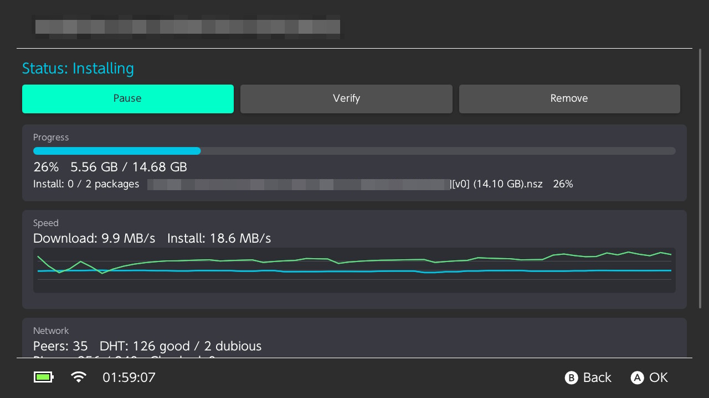
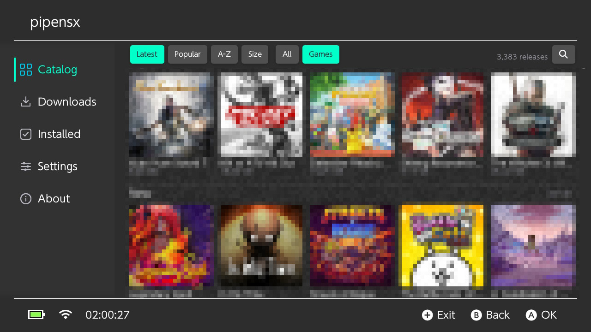
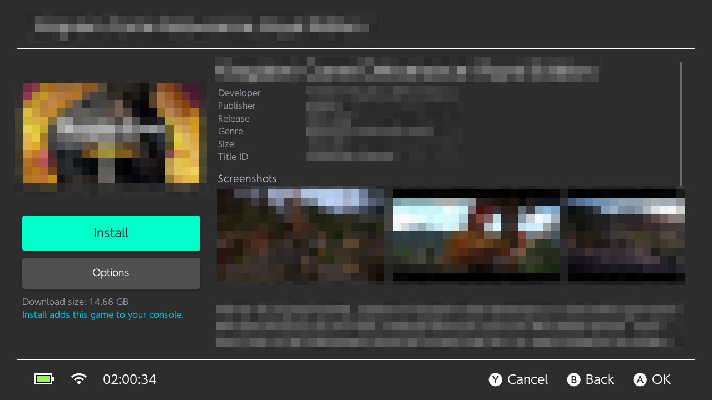
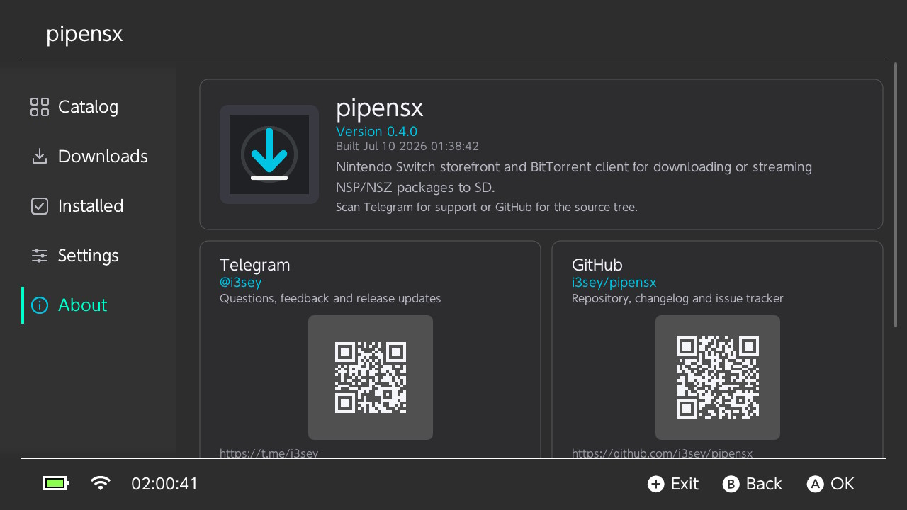

# pipensx

[](https://github.com/i3sey/pipensx/actions/workflows/ci.yml)
[](https://github.com/i3sey/pipensx/actions/workflows/golden.yml)
[](LICENSE)

Native BitTorrent download manager and streaming package installer for
Nintendo Switch homebrew.



<br><br>




> [!IMPORTANT]
> pipensx does not include Nintendo keys, firmware, games, or a torrent catalog.
> Use it only with content you are legally allowed to download and install. The
> project is not affiliated with Nintendo, RuTracker, or the catalog provider.

> [!NOTE]
> This project was developed with substantial assistance from AI tools for code
> generation, refactoring, testing, review, and documentation. Changes are
> still built and validated before they are merged.

## Features

- native Borealis interface with controller, touch, light/dark, handheld, and
  docked support
- persistent FIFO queue with pause, resume, retry, recheck, and safe shutdown
- restart-safe piece verification and download recovery
- tracker, DHT, and PEX peer discovery
- live, cached catalog loaded from the allowlisted
  [`Langegen/switch-games`](https://github.com/Langegen/switch-games) source
- offline magnet resolution when the catalog provides a verified info dictionary
- download-only mode and sequential NSP/NSZ installation while pieces arrive
- Application, Patch, and AddOnContent packages with installed-version checks
- download diagnostics, speed history, peer state, and extended telemetry

The public build intentionally starts without a bundled catalog or game
metadata index. On first use, the Catalog view refreshes from the trusted source
and then uses its on-SD cache.

## Quick start

Clone the pinned submodules:

```bash
git clone --recurse-submodules https://github.com/i3sey/pipensx.git
cd pipensx
```

Run the portable PC test suite:

```bash
make test
```

Build the Nintendo Switch application after installing devkitPro dependencies:

```bash
export DEVKITPRO=/opt/devkitpro
make switch
```

The resulting application is `build-switch/pipensx.nro`. See
[BUILD.md](BUILD.md) for dependency installation, golden tests, optional
metadata input, and deployment helpers.

## Install on Nintendo Switch

Copy the NRO to:

```text
SD:/switch/pipensx/pipensx.nro
```

Launch it through hbmenu in **application mode** by holding `R` while opening a
game. Album applet mode is rejected because it does not provide enough memory
and network resources for the application.

Runtime data is stored below `SD:/switch/pipensx/`, including:

```text
queue.bencode
torrents/
downloads/
dht_nodes.bin
catalog/catalog.json
catalog/metadata/
catalog/images/
pipensx.log
```

The interface displays contextual controller hints. The main actions cover
adding torrents, opening details, pausing/resuming, retrying/rechecking, and
safely stopping the active task before exit.

## Catalog and network behavior

The application fetches `switch_games.json` over HTTPS from an exact
repository-prefix allowlist. Redirects or look-alike hosts are rejected before
catalog bytes are parsed. A failed refresh leaves the last valid SD-card cache
active.

Catalog magnets are resolved from a pre-verified info dictionary when one is
available, otherwise through BitTorrent extension-protocol peers. Received
metadata is checked against the magnet info hash before entering the normal
torrent preview and queue flow.

Only one torrent downloads at a time. Existing files are verified before a task
starts or resumes. Interrupted packages restart from their beginning; packages
committed before the interruption remain installed and are skipped. Runtime
behavior such as sleep/wake and long installs must ultimately be validated on
physical Switch hardware.

## Contributing and security

Read [CONTRIBUTING.md](CONTRIBUTING.md) before sending a change. Report
vulnerabilities privately as described in [SECURITY.md](SECURITY.md); do not
place secrets or copyrighted datasets in issues or fixtures.

Historical implementation notes are archived under
[`docs/plans/`](docs/plans/README.md). They are not the current roadmap.

## License

pipensx is licensed under the GNU General Public License v3.0. See
[LICENSE](LICENSE). Third-party components retain their original licenses as
listed in [THIRD_PARTY_NOTICES.md](THIRD_PARTY_NOTICES.md).
